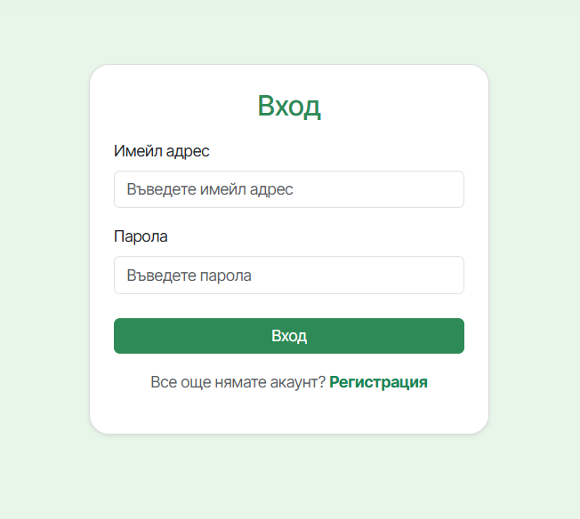
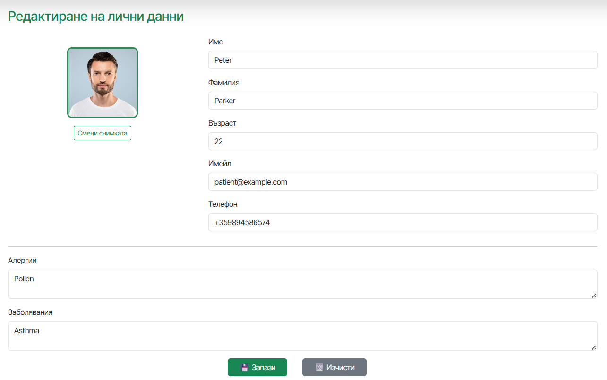

# MedConnect

MedConnect is a healthcare management project developed for the [Software Technologies] course at [TU - Sofia]. It is a web-based ecosystem designed to bridge the communication gap between patients, and guardians and doctors, ensuring streamlined medical care and real-time health monitoring.

The platform is built using Spring Boot v3.5.7 for a robust and secure backend, and React.js v19.2.0 for a dynamic, responsive frontend. By integrating services like Google Gemini AI for consultations and Stripe for billing, MedConnect transforms the traditional doctor-patient interaction into a modern, digital experience.

In summary, the software simplifies healthcare administration by automating appointment scheduling, digitizing prescription management, and providing AI-driven medical insights.

---


## Functionalities ⚙️

The following functionalities are supported by the platform:

### 1. User Management

In MedConnect, role-based user profiles can be created for Patients, Doctors, and Guardians. Each user registers according to their role, with doctors providing additional professional information such as specialization and years of experience, and guardians providing information about the patients under their care. Authentication is implemented using JWT-based security, ensuring controlled access to system resources based on assigned roles.

#### Registration
The registration process captures essential medical and profile data specific to the user's role.
<p align="center">
  
</p>

#### Authentication
Secure login is handled via a dedicated interface, issuing a `JWT` for session management.
<p align="center">
  
</p>

#### User Profile & Account Customization
Once authenticated, every user has access to a dedicated profile tab. Users can manage their personal information, update medical identifiers, and upload a profile photo.

<p align="center">
  
</p>
<p align="center">
  
</p>


- **Calendar & Appointments** – Book, view, and cancel doctor appointments with Google Calendar integration
- **AI Doctor (Gemini)** – Symptom checking and AI-based medical consultations
- **Prescriptions & Medications** – Access prescriptions and medication schedules
- **Map Integration** – Find nearby pharmacies and medical centers using Google Maps
- **File Storage** – Secure upload and storage of medical documents
- **Subscriptions** – Manage subscription plans and payments via Stripe

### Doctors

- **Dashboard** – View daily schedules and upcoming examinations
- **Patient Management** – Access patient profiles and medical history
- **Electronic Prescriptions** – Issue prescriptions digitally
- **Schedule Configuration** – Define working hours and special exceptions

###  Guardians

- **Patient Monitoring** – Track schedules and health status of entrusted patients
- **Shared Calendar** – View patient appointments and events

---

## Tech Stack

### Client Side

- **Framework:** React.js
- **Styling:** CSS, PostCSS
- **Routing:** React Router
- **API Communication:** Axios
- **Maps:** Google Maps API

### Server Side

- **Framework:** Java Spring Boot
- **Build Tool:** Maven
- **Database:** PostgreSQL or MySQL (configurable)
- **Security:** Spring Security, JWT (JSON Web Tokens)
- **External Services:**
  - Google Cloud (Calendar API, Maps API, Gemini AI)
  - Stripe (Payments)
  - Twilio (SMS Notifications)

---

## Installation & Setup

To run MedConnect locally, both the **server** and **client** applications must be configured.

### Prerequisites

- Node.js & npm
- Java JDK 17+
- Maven
- Docker (optional, for database setup)

---

## Server Setup

1. Open a terminal and navigate to the `server` directory.
2. Configure environment variables or edit `src/main/resources/application.yml` with:
   - Database credentials (URL, username, password)
   - Stripe API keys
   - Twilio API keys
   - Google Cloud credentials (`credentials.json`)
3. Install dependencies and start the server:

```bash
cd server
./mvnw spring-boot:run
```

The server will start on **http\://localhost:8080** by default.

---

## Client Setup

1. Open a new terminal and navigate to the `client` directory.
2. Install dependencies:

```bash
cd client
npm install
```

3. Start the React application:

```bash
npm start
```

The client will be accessible at [**http://localhost:3000**](http://localhost:3000).

---

## Docker Setup (Optional)

A `docker-compose.yml` file is provided in the `server` directory.

To start the services using Docker:

```bash
cd server
docker-compose up -d
```

---

## API Key Configuration

To enable full functionality, configure the following API keys:

- **Google Maps API Key** – Set in `client/public/index.html` or `.env`
- **Gemini API Key** – Required for AI Doctor functionality
- **Stripe Publishable & Secret Keys** – Required for subscriptions and payments

---

## Documentation

Detailed project documentation is available in the `docs/` directory:

- **Architecture.docx** – System architecture and design
- **Functional\_Description.docx** – Detailed feature descriptions

---

## © License

© 2025 MedConnect. All rights reserved.

