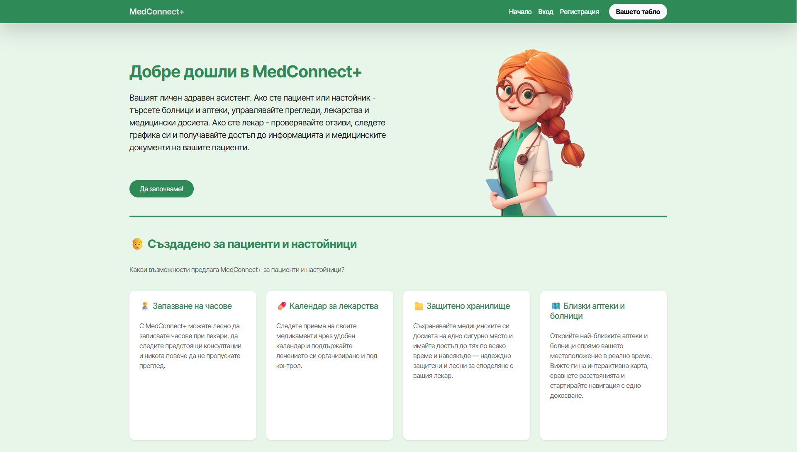
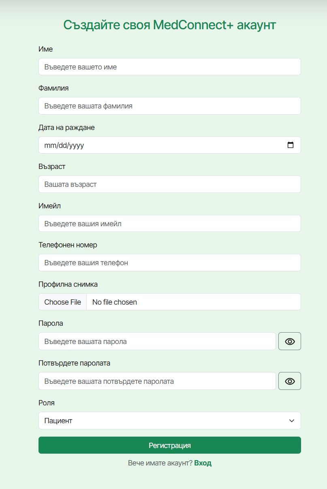
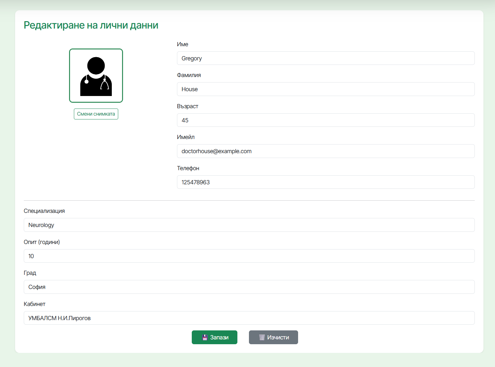
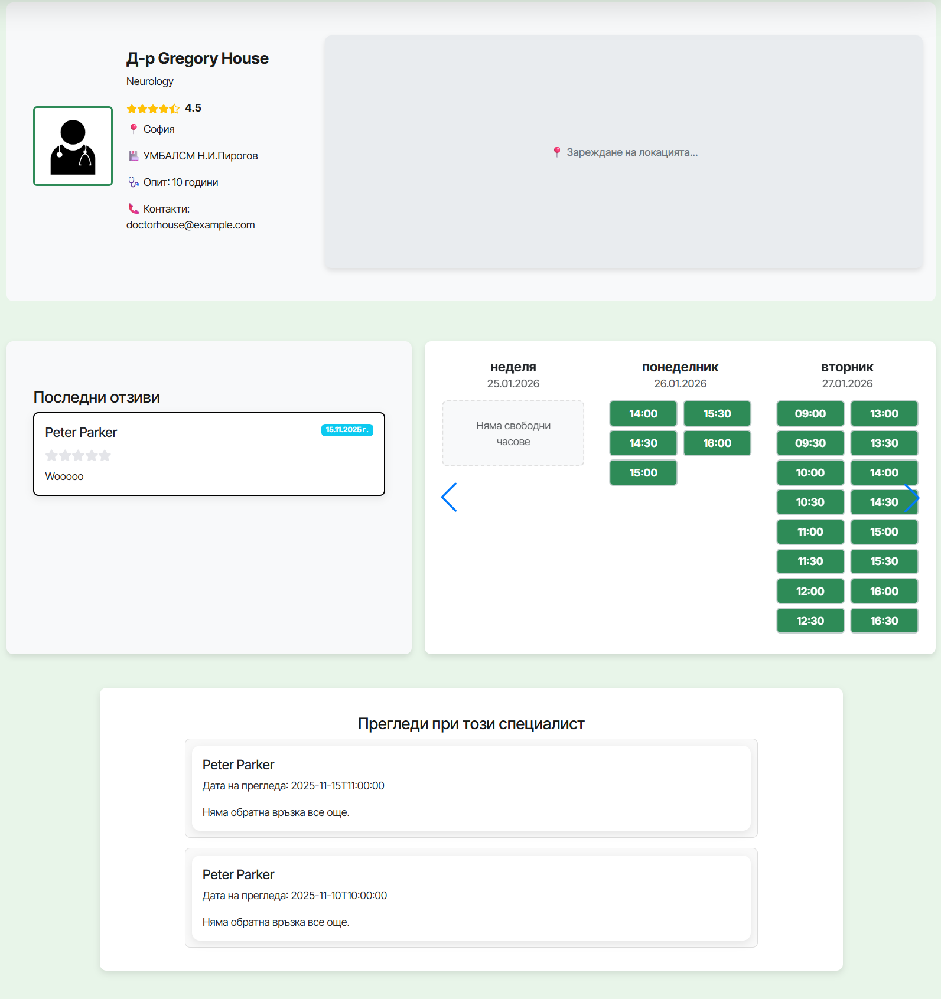
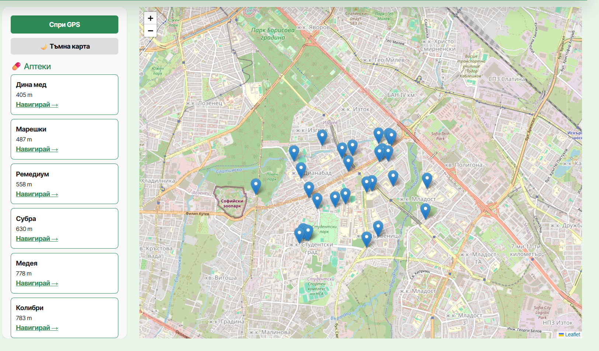
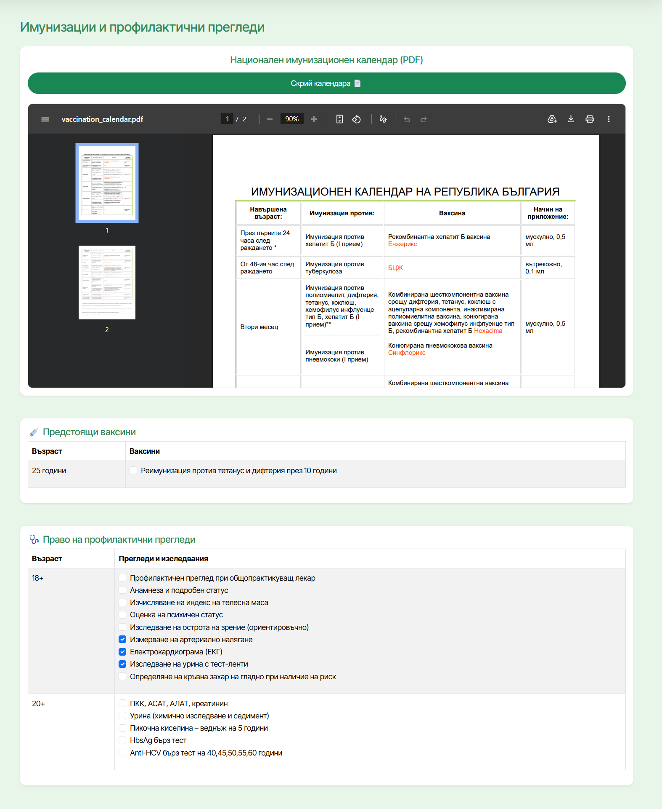
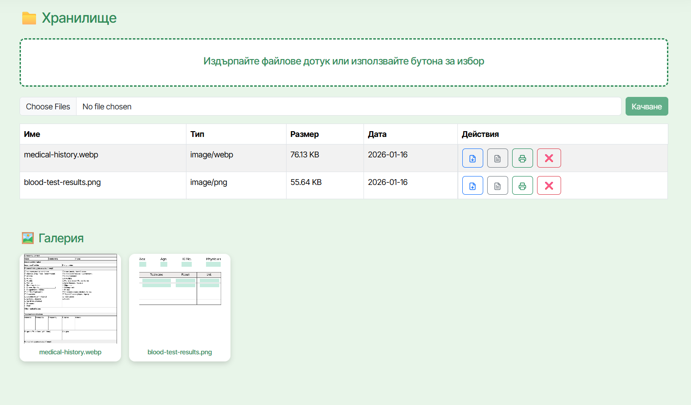
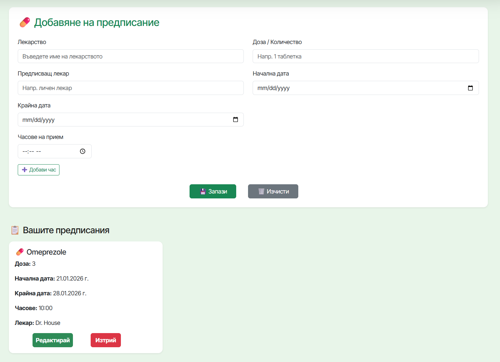
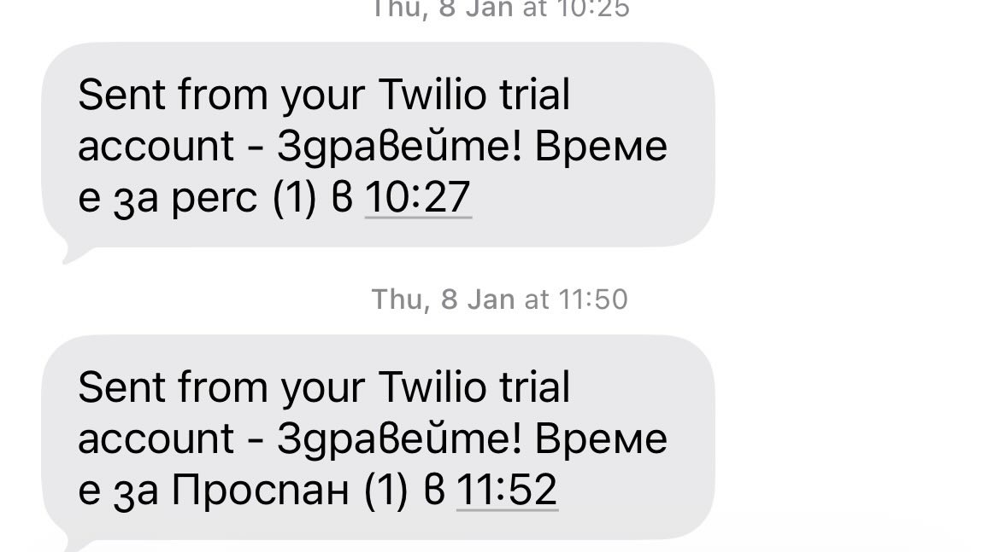
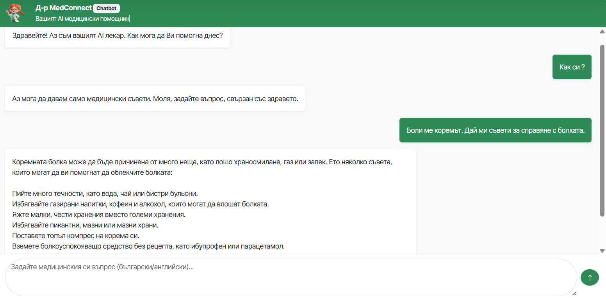

# MedConnect 🩺

MedConnect is a healthcare management project developed for the **Software Technologies** course at **TU - Sofia**. It is a web-based ecosystem designed to bridge the communication gap between patients, and guardians and doctors, ensuring streamlined medical care and real-time health monitoring.

The platform is built using **Spring Boot v3.5.7** for the backend, and **React.js v19.2.0** for the frontend. By integrating services like Google Gemini AI for consultations and Stripe for billing, MedConnect transforms the traditional doctor-patient interaction into a modern, digital experience.

In summary, the software simplifies healthcare administration by automating appointment scheduling, digitizing prescription management, and providing AI-driven medical insights.

---


## Table of Contents 📋

* [Functionalities](#functionalities-️)
    * [User Management](#1-user-management)
    * [Doctor Selection & Scheduling](#2-doctor-selection--scheduling)
    * [Hospitals and Pharmacies](#3-hospital-and-pharmacies-around-me)
    * [Vaccines Scheduler](#4-vaccines-scheduler)
    * [File Storage](#5-file-storage)
    * [User Calendar](#6-user-calendar)
    * [Subscriptions](#7-subscriptions)
    * [Prescription Reminder](#8-prescription-reminder-semi-premium-feature)
    * [AI Doctor Assistant](#9-ai-doctor-assistent-premium-feature)
* [Technology Stack](#tech-stack-)
* [Installation & Setup](#installation--setup-)
    * [Prerequisites](#prerequisites)
    * [Server Setup](#server-setup)
    * [Client Setup](#client-setup)
* [Application Usage](#api-key-configuration-)
* [Documentation](#documentation-)

---

## Functionalities ⚙️

The following functionalities are supported by the platform:

### 1. User Management

In MedConnect, role-based user profiles can be created for Patients, Doctors, and Guardians. Each user registers according to their role, with doctors providing additional professional information such as specialization and years of experience, and guardians providing information about the patients under their care. Authentication is implemented using JWT-based security, ensuring controlled access to system resources based on assigned roles.

#### Registration
The registration process captures essential medical and profile data specific to the user's role.
<p align="center">
  
</p>

#### Authentication
Secure login is handled via a dedicated interface, issuing a `JWT` for session management.
<p align="center">
  
</p>

#### User Profile & Account Customization
Once authenticated, every user has access to a dedicated profile tab. Users can manage their personal information, update medical identifiers, and upload a profile photo.

<p align="center">
  
</p>
<p align="center">
  
</p>

### 2. Doctor Selection & Scheduling

Patients and Guardians can select from a directory of available Doctors to schedule appointments at mutually convenient times. Following a completed examination, users can provide feedback by leaving a review and rating their experience.

<p align="center">
  
</p>
<p align="center">
  
</p>


### 3. Hospital and Pharmacies around me

Patients and guardians can check nearby hospitals and pharmacies by enabling geolocation.

<p align="center">
  
</p>

### 4. Vaccines Scheduler

The Vaccine Scheduler allows patients and guardians to manage vaccination schedules by tracking upcoming and completed vaccines. The feature provides calendar-based reminders to ensure timely vaccinations according to recommended schedules.

<p align="center">
  
</p>

### 5. File Storage

Patients and guardians can upload medical-related files such as laboratory results, medical reports, imaging summaries, and discharge documents, which are visible to doctors to support accurate diagnosis and treatment.

<p align="center">
  
</p>


### 6. User Calendar

All users can access a personal calendar to track upcoming and past activities. Patients and guardians can review previous and scheduled doctor appointments, as well as follow medication reminders. Doctors can manage their timetables by viewing upcoming appointments and adjusting their schedules, either partially by modifying working hours or fully by marking specific days as non-working.

<p align="center">
  
</p>
<p align="center">
  
</p>

### 7. Subscriptions

Patients and guardians can choose between monthly and annual premium subscription plans, which unlock two premium features: an AI doctor assistant and medication reminders.

<p align="center">
  
</p>

### 8. Prescription Reminder (Semi-Premium feature)

Medication reminders are displayed as calendar entries based on the medicines provided by the user. Each reminder appears on the calendar at the scheduled time to help users follow their prescribed medication routine. With an active premium subscription, users additionally receive periodic SMS notifications to ensure timely medication intake.

<p align="center">
  
</p>
<p align="center">
  
</p>

### 9. AI doctor assistent (Premium feature)


The AI medical assistant provides medical-related advice exclusively to users with an active premium subscription. It assists with initial symptom checking and offers guidance for managing minor health issues, serving as a preliminary support tool rather than a replacement for professional medical care.

<p align="center">
  
</p>


## Tech Stack 🚀

### Client Side

- **Framework:** React.js
- **Styling:** React-Bootstrap
- **Routing:** React Router

### Server Side

- **Framework:** Java Spring Boot
- **Build Tool:** Maven
- **Database:** PostgreSQL
- **Security:** Spring Security, JWT (JSON Web Tokens)
- **External Services:**
  - Google Cloud (Gemini AI)
  - Stripe (Payments)
  - Twilio (SMS Notifications)

---

## Installation & Setup 💻

To run MedConnect locally, both the **server** and **client** applications must be configured.

### Prerequisites

- Node.js & npm
- Java JDK 17+
- Maven
- Docker (optional, for database setup)

---

## Server Setup

1. Open a terminal and navigate to the `server` directory.
2. Configure environment variables or edit `src/main/resources/application.yml` with:
   - Database credentials (URL, username, password)
   - Stripe API keys
   - Twilio API keys
   - Google Cloud credentials (`credentials.json`)
3. Install dependencies and start the server:

```bash
cd server
./mvnw spring-boot:run
```

The server will start on **http\://localhost:8080** by default.

---

## Client Setup

1. Open a new terminal and navigate to the `client` directory.
2. Install dependencies:

```bash
cd client
npm install
```

3. Start the React application:

```bash
npm start
```

The client will be accessible at [**http://localhost:3000**](http://localhost:3000).

---

## Docker Setup (Optional)

A `docker-compose.yml` file is provided in the `server` directory.

To start the services using Docker:

```bash
cd server
docker-compose up -d
```

---

## API Key Configuration 🔑

To enable full functionality, configure the following API keys:

- **Google Maps API Key** – Set in `client/public/index.html` or `.env`
- **Gemini API Key** – Required for AI Doctor functionality
- **Stripe Publishable & Secret Keys** – Required for subscriptions and payments

---

## Documentation 📋

Detailed project documentation is available in the `docs/` directory:

- **Architecture.docx** – System architecture and design
- **Functional\_Description.docx** – Detailed feature descriptions

---

## © License

© 2025 MedConnect. All rights reserved.

